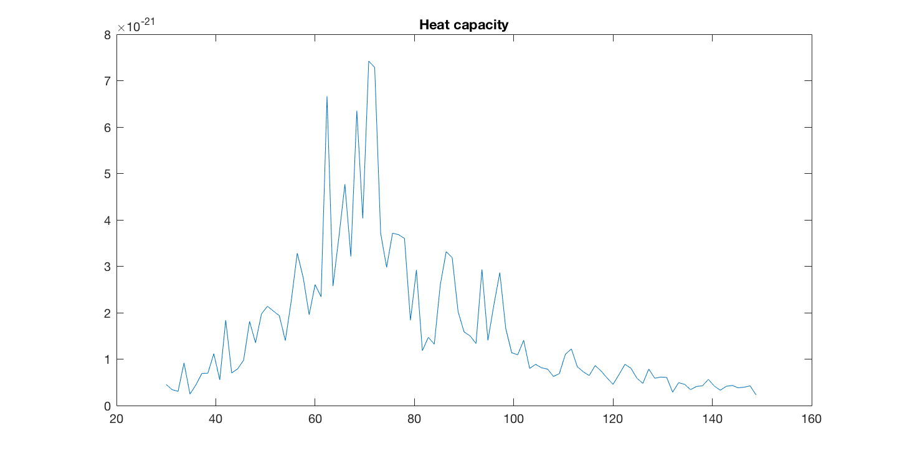

## Ising model monte carlo

Was reading the statistical physics coursebook on a boring Easter at home and this exercise caught my eye.

Managed to get some kind of a phase transition and called it a day...

